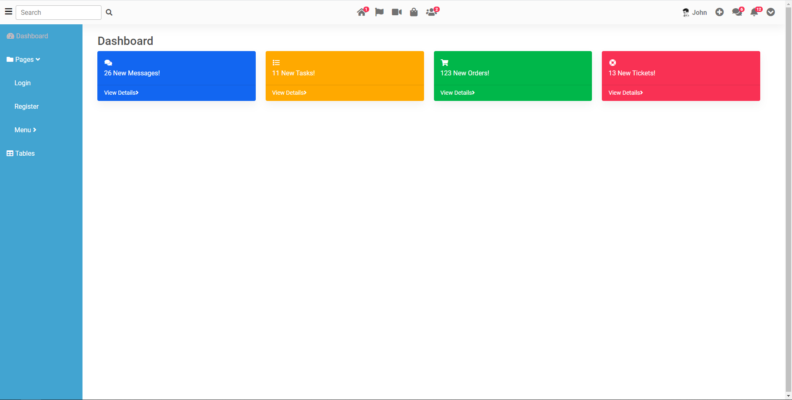

## MDB 5 VUE UI KIT template

---

It is small template using MDB5 VUE UI KIT frame work.

## UI reference link

https://mdbootstrap.com/docs/b5/vue/

### Screenshot

---

## Technologies

---

A list of technologies used within the project:

- [Vue](https://v3.vuejs.org/): Version 3
- [vue Router](https://unpkg.com/vue-router@4): Version 4
- [MDBVue UI](https://mdbootstrap.com/docs/b5/vue/): Version 5

## Notes

---

- Before running this app in your local make sure you have the web server installed in your machine.
- Since, we have used cdn's to load the required libraries use a server like an apache to run the app.
- As of now, we are used downloaded cdn files from assets folder and As well, commented cdn direct links in index.html file for your optional way.